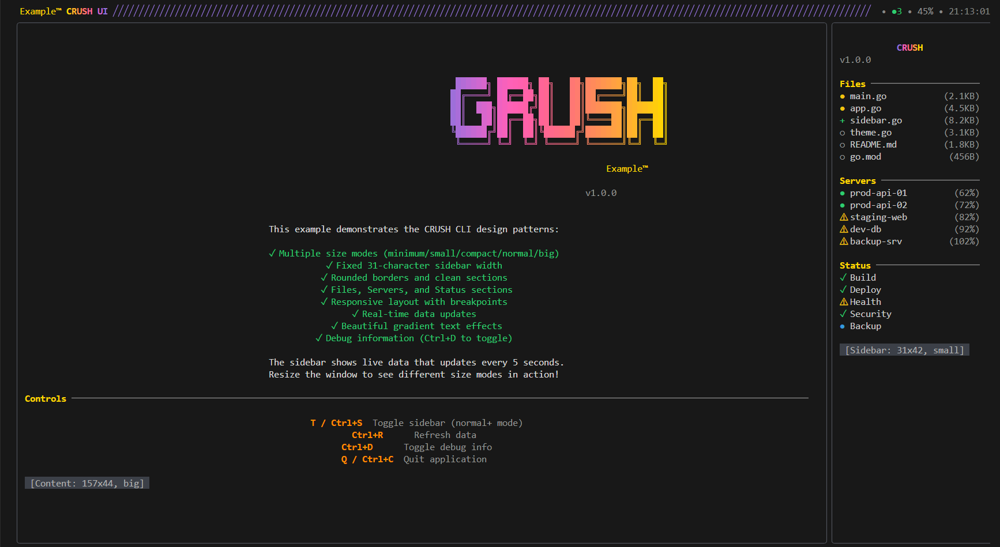

# CRUSH UI Framework

A reusable TUI framework inspired by the CRUSH CLI



## Core Components
- **Header**: Displays branding and status (data injectable)
- **Content**: Main content area (fully injectable)
- **Sidebar**: Right panel with sections (sections injectable)

## 🎯 Quick Start

### Using Default Configuration
```go
package main

import (
    tea "github.com/charmbracelet/bubbletea"
    "ui_example/ui"
)

func main() {
    // Creates app with default providers (Files, Servers, Status sections)
    app := ui.NewDefaultApp()
    
    p := tea.NewProgram(app, tea.WithAltScreen())
    p.Run()
}
```

### Custom Configuration
```go
package main

import (
    tea "github.com/charmbracelet/bubbletea"
    "ui_example/ui"
    "ui_example/ui/providers"
)

func main() {
    // Create custom providers
    contentProvider := NewMyContentProvider()
    headerProvider := NewMyHeaderProvider()
    
    // Configure custom sidebar sections
    sections := []providers.SidebarSection{
        NewMyTasksSection(),
        NewMyMetricsSection(),
    }
    
    // Create app configuration
    config := &providers.AppConfig{
        ContentProvider:             contentProvider,
        HeaderDataProvider:          headerProvider,
        SidebarSections:             sections,
        ShowSidebarByDefault:        true,
        CompactModeWidthBreakpoint:  120,
        CompactModeHeightBreakpoint: 30,
    }
    
    // Create reusable app
    app := ui.NewReusableApp(config)
    
    p := tea.NewProgram(app, tea.WithAltScreen())
    p.Run()
}
```


## Project Structure

```
ui_example/
├── ui/
│   ├── components/          # UI components (styling logic)
│   ├── providers/           # Provider interfaces and defaults
│   ├── styles/             # Theme and styling utilities
│   ├── app.go              # Original app (backward compatibility)
│   └── reusable_app.go     # New configurable app
├── examples/
│   └── custom_app.go       # Complete customization example
└── main.go                 # Default app example
```

## Dependencies

- `github.com/charmbracelet/bubbletea`: TUI framework
- `github.com/charmbracelet/lipgloss`: Styling and layout
- `github.com/lucasb-eyer/go-colorful`: Color manipulation
- `github.com/rivo/uniseg`: Unicode text segmentation